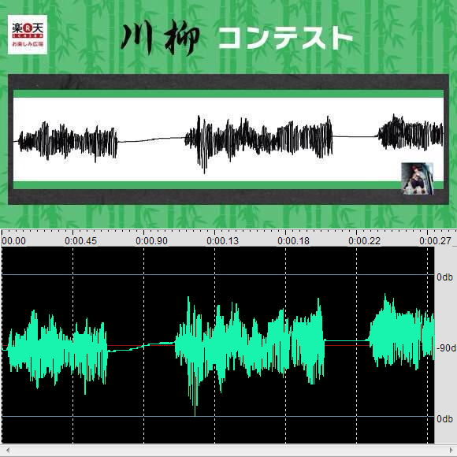

# img2wav

convert a freehand waveform image to an audio file

## Screenshot

upper: a freehand waveform image  
lower: an audio file

## References

[ぼく脳](https://twitter.com/_bokunou/status/542279805853396993/photo/1 "ぼく脳")
